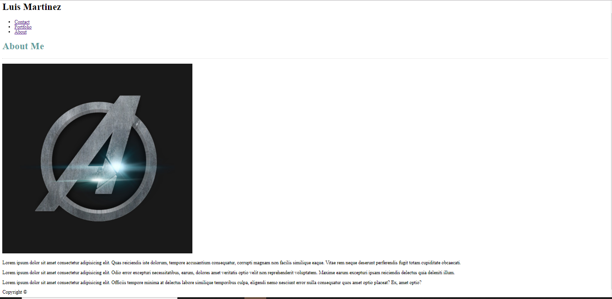
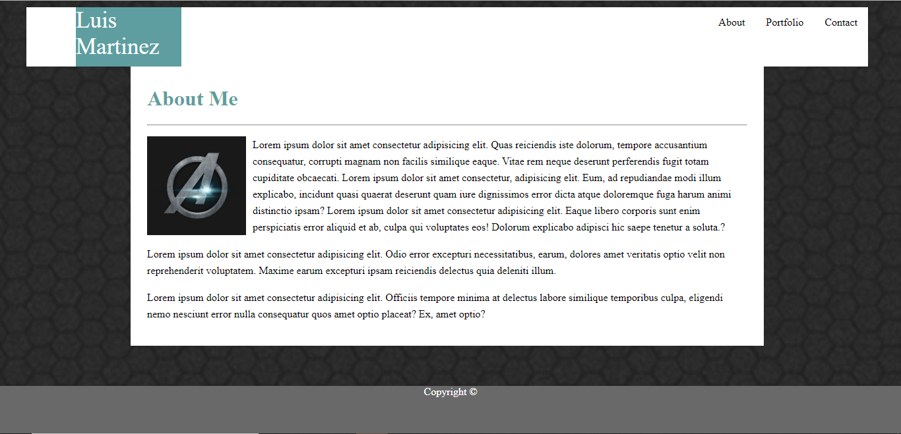
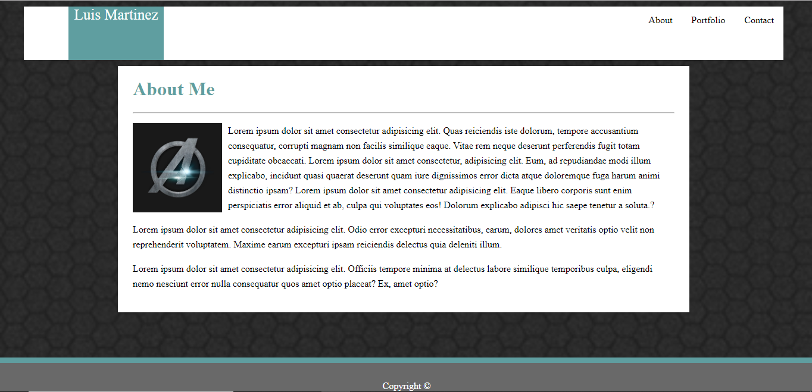
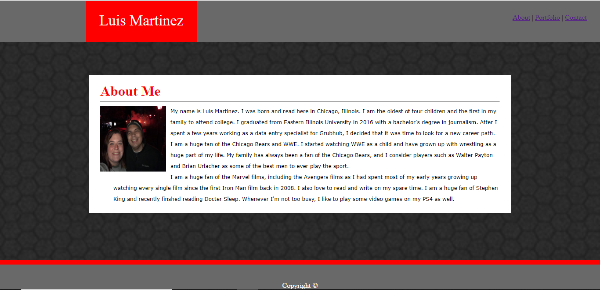
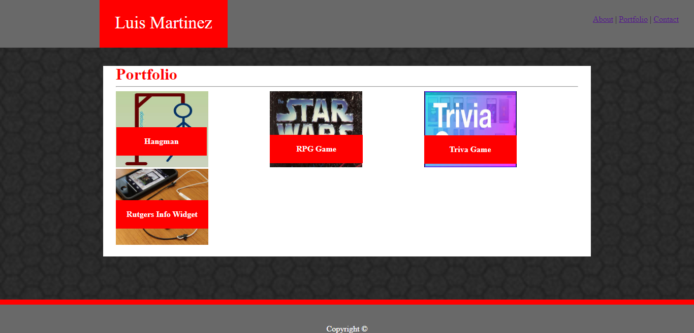

# Portfolio Assignment

So for this assignment, I first started with creating the files, index.html; portfolio.html and contact.html
Next I created an Asset folder with two sub folder inside titled css and images.

#First Steps

I started working on the indext.html file since once that was working it would be easy to use the same formatting to work on the other two files.

Once the inital code was typed up, I started to work on the style.css page, but ran in a few problems early on.

The first issue was trying to get the image to fit instead taking up most of the screen.

# Working On CSS

I started working on style.css page, using a combination of diferent class, id and tag to work on the nav bar and footer section.

The Navbar was causing problem as I had trouble figuring out how to place the links in the correct place and required a lot of trial and error.

The second problem was within the footer. I was having trouble getting to copyright to stay in the center and near the edge of the screen on the bottom.

I found out that I was doing the navbar code all wrong so that was a simple fix once I found out the right code.

Once everything was in place on the index.html, the only remaing problem was that there was a noticable empty space around the navbar. 

This was fixed once I added the reset.css file to all three html files.

Once the index.html page was finshed, I went to work copying and pasting the code over to the remaining files and began tweaking the code as needed.

A lot of the coding was trial and error and using inspect on the website page as needed in order to make the proper adjustments. Once they were finished, I had to added the images and text to their proper places.

# Final images

